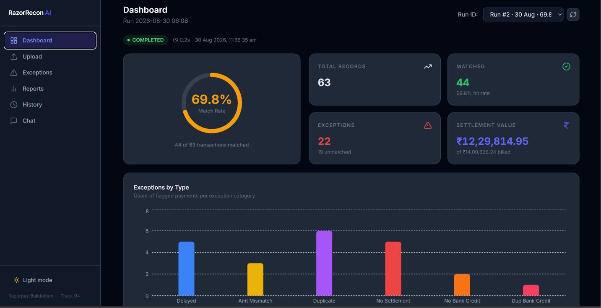
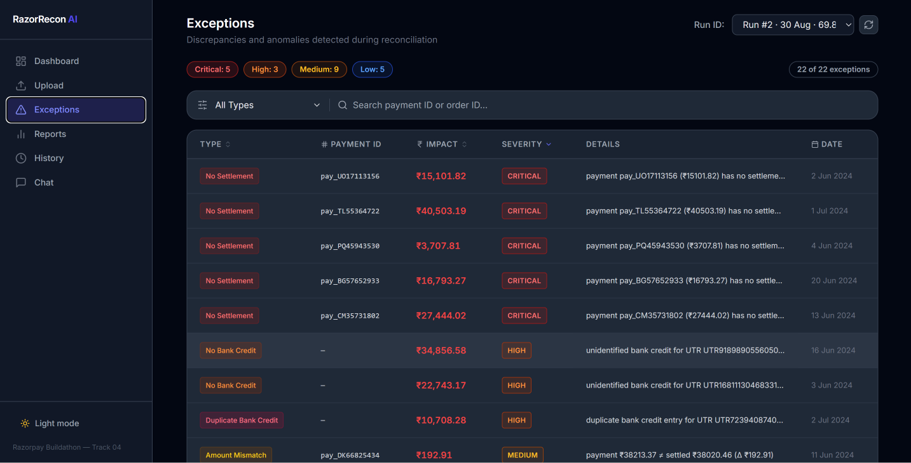
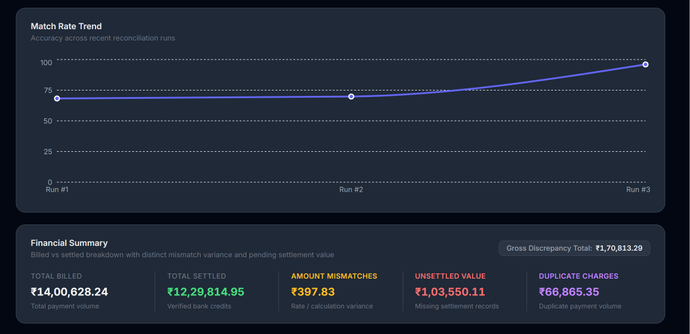
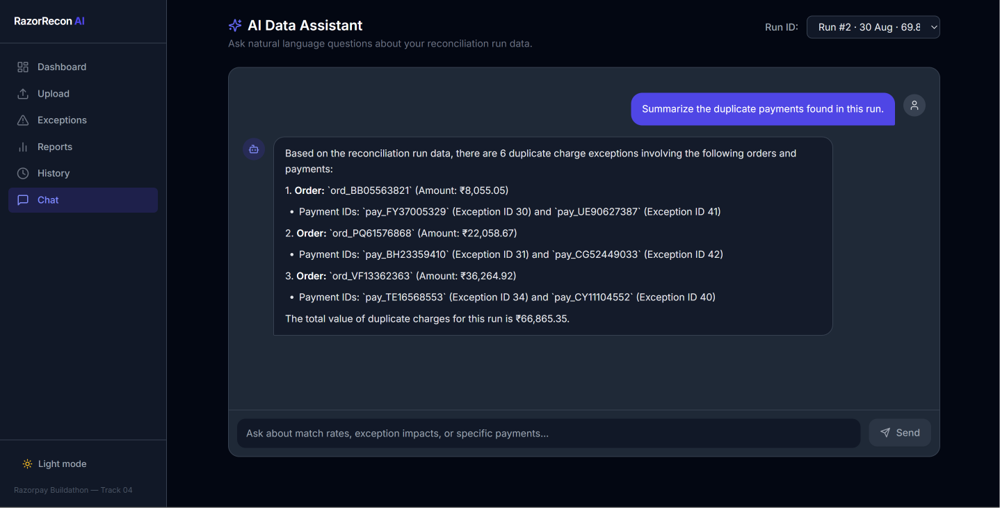
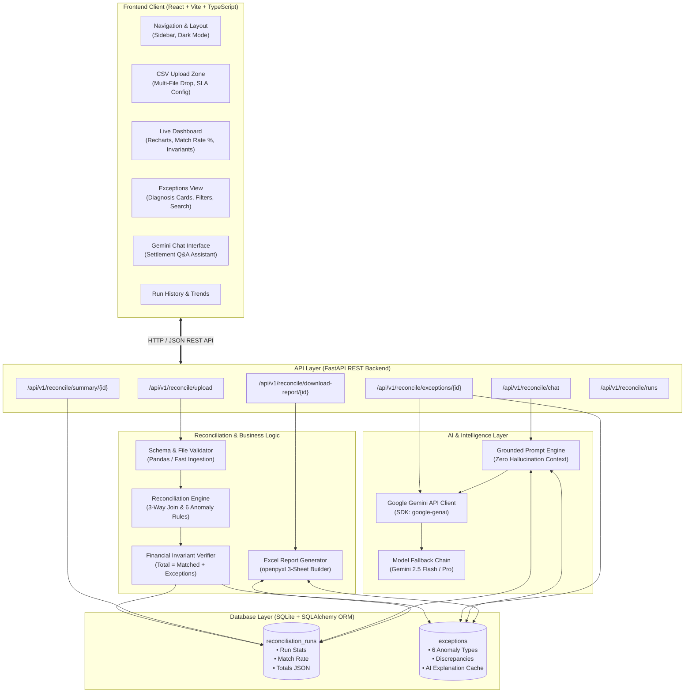

# RazorRecon AI

**An AI-powered finance controller that reconciles payments, settlements, and bank statements — catching mismatches, duplicates, and delays that manual reconciliation misses, with an AI assistant for finance operations teams.**

Built for the Razorpay Buildathon — Track 04: AI Finance Controller.

---

## Screenshots

| Dashboard Overview | Exception Diagnosis |
| :---: | :---: |
|  |  |

| Financial Summary & Reports | Settlement Q&A Assistant |
| :---: | :---: |
|  |  |

---

## The Problem

Every settlement cycle, finance teams manually cross-check thousands of payments against internal settlement records and bank credits. Mismatches, duplicates, unsettled payments, and SLA breaches hide inside that data — and finding them by hand is slow, error-prone, and doesn't scale.

In financial operations, I've observed that **verification capacity, not generation speed, is the real bottleneck.** Anyone can generate numbers or export a spreadsheet. The hard part is mathematically verifying that transactions across internal ledgers, gateway settlements, and bank credits agree — and providing instant, actionable diagnoses for every discrepancy found.

RazorRecon AI automates that verification loop end-to-end: upload three CSVs, get a match rate, a categorized exception list, and an AI assistant that can answer questions about what it found — all grounded in the real data, nothing invented.

---

## What It Does

1. **Upload** three CSVs — `payments.csv`, `settlements.csv`, `bank_statement.csv`
2. **Reconcile** automatically using a rule-based Pandas engine, cross-matching all three sources
3. **Detect** six categories of exceptions:
   - **Unmatched Payments:** Payments with no matching settlement record (`UNMATCHED_NO_SETTLEMENT`)
   - **Unmatched Settlements:** Gateway settlements with no matching bank credit (`UNMATCHED_NO_BANK_CREDIT`)
   - **Duplicate Charges:** Multiple payments for the same order and amount within a close window (`DUPLICATE`)
   - **Amount Mismatches:** Settled amount ≠ internal payment amount beyond tolerance (`AMOUNT_MISMATCH`)
   - **Delayed Settlements:** Settlement lag exceeding SLA, default T+2 days (`DELAYED_SETTLEMENT`)
   - **Duplicate Bank Credits:** Multiple bank credits referencing the exact same settlement UTR (`DUPLICATE_BANK_CREDIT`)
4. **Report** a match rate, a full exception list with severity levels, and a financial breakdown that splits the total discrepancy into exactly what it's made of — genuine rate mismatches, still-pending settlements, and duplicate-charge exposure — rather than one opaque number
5. **Explain** every exception in plain English using Gemini, grounded strictly in the actual data (no invented numbers or IDs)
6. **Answer questions** through a Settlement Q&A chatbot — ask things like *"which exception has the highest amount impact?"* and get an answer citing real payment IDs and figures
7. **Export** a formatted Excel report (Summary, Exceptions, and Raw Reconciliation sheets) for the finance team
8. **Track history** across multiple reconciliation runs, with a match-rate trend chart over time

---

## Live Example (Sample Data)

On a 63-record sample batch, seeded reproducibly (`random.seed(42)`):

| Metric | Value |
|---|---|
| Match Rate | 68.3% |
| Total Records | 63 |
| Matched | 43 |
| Total Exceptions | 23 |
| Total Billed | ₹15,90,488.38 |
| Total Settled | ₹13,70,222.08 |
| Gross Discrepancy | ₹2,20,266.30 |
| — of which, Amount Mismatches | ₹1,659.62 |
| — of which, Unsettled Value | ₹1,56,084.25 |
| — of which, Duplicate Charges | ₹62,522.43 |
| Processing time | ~1–3 seconds |

Every exception in this run is independently verifiable — the sample data generator prints out exactly which anomalies it injected, and the reconciliation engine catches 100% of them.

---

## Architecture



### Route Table & Components

```text
React + Vite + TypeScript + Tailwind (frontend, port 5173)
        │  REST calls (axios)
        ▼
FastAPI backend (port 8001)
        │
        ├── POST   /api/v1/reconcile/upload                   → validates & saves the 3 CSVs
        ├── POST   /api/v1/reconcile/run                      → runs the Pandas engine, persists results
        ├── GET    /api/v1/reconcile/summary/{run_id}         → match rate, exception counts, financial split
        ├── GET    /api/v1/reconcile/exceptions/{run_id}      → paginated, filterable exception list
        ├── GET    /api/v1/reconcile/exceptions/{run_id}/ai-analysis → cached AI exception explanations
        ├── GET    /api/v1/reconcile/report/{run_id}          → downloadable formatted Excel report (.xlsx)
        ├── GET    /api/v1/reconcile/runs                     → history of past runs
        ├── DELETE /api/v1/reconcile/runs/{run_id}            → delete a single reconciliation run
        ├── DELETE /api/v1/reconcile/runs                     → clear all reconciliation runs
        ├── POST   /api/v1/reconcile/chat                     → Gemini-powered Settlement Q&A
        └── GET    /api/v1/summary/trends                     → match rate trends over time

SQLite — stores runs, exceptions, and cached AI analysis (so results survive a refresh
and don't re-call the Gemini API on every page load)

Gemini API (google-genai SDK) — two features:
  (a) plain-English exception explanations, batched and cached
  (b) a Settlement Q&A chatbot, grounded in the full run's structured data
```

A single FastAPI monolith and a single React app — clean, fast, and standalone.

---

## Key Design Decisions

**Pre-join detection of duplicate bank credits.** The sample data generator's documented ground-truth list does not include double bank credits — this edge case was discovered during development by investigating a record-count mismatch, and a dedicated detection rule (`find_duplicate_bank_credits`) was implemented for it. It runs before the join step deduplicates bank statement rows, ensuring the duplicate credit is flagged as an exception rather than silently dropped during preprocessing.

**Match rate denominator reflects payment volume.** `total_records` in the summary counts customer payments only; orphan bank credits are isolated and flagged separately rather than folded into the denominator. This preserves business clarity: the match rate directly answers *"of the payments we processed, what percentage reconciled cleanly without discrepancy?"* Bank credits are settlements received, not customer payments.

**No vector RAG for the chatbot.** The dataset is ~60–100 records per run — small enough to pass the entire structured summary and exception list directly into the Gemini prompt on every call. Building embeddings and a vector store for a dataset this size would be over-engineering, not sophistication. This is a deliberate scoping decision.

**Exception rules resolve by priority, not by first-match.** When a single transaction could be flagged by more than one rule — for example, a duplicate payment that also has no settlement — the engine applies a fixed priority order (`DUPLICATE` > `UNMATCHED_NO_SETTLEMENT` > `UNMATCHED_NO_BANK_CREDIT` > `AMOUNT_MISMATCH` > `DELAYED_SETTLEMENT`) so every exception gets exactly one, most-specific diagnosis instead of being double-counted or mislabeled.

**The financial discrepancy is split into three honest categories, not one number.** Billed minus Settled produces a gross discrepancy figure, but that figure is a mix of genuinely different situations: money that's simply pending settlement, money lost to duplicate charges, and money lost to real rate/calculation errors. Reporting these separately — and verifying, in code and in tests, that they sum exactly to the gross total — avoids the misleading framing of calling pending settlements "errors."

**AI outputs are grounded and cached, not trusted blindly.** Every AI-generated explanation and every chatbot answer is built strictly from the run's actual database records, with an explicit instruction to the model never to invent numbers, dates, or IDs. Results are cached in SQLite after the first call, so repeat views don't re-hit the API. This was independently verified multiple times during development — every specific number and payment ID a chatbot or explanation returned was cross-checked against the raw exception records and matched exactly.

**Reproducible test data.** The sample data generator uses a fixed random seed by default, so anyone who clones this repo and runs it gets identical output — including a printed summary of exactly which anomalies were injected, so the reconciliation engine's accuracy can be checked against known ground truth.

---

## Known Limitations

- **Gemini Free Tier Quotas:** The Gemini API enforces daily request quotas. To prevent quota exhaustion and eliminate redundant network round-trips, all AI-generated exception explanations are persisted to SQLite upon first generation and served exclusively from cache on subsequent views and report exports.
- **Single-Currency Ingestion:** The current rule engine assumes a unified currency (e.g. INR) across internal and external feeds.
- **File-Based Batch Processing:** Built for scheduled batch ingestion via CSV rather than continuous streaming socket connections.

---

## Tech Stack

- **Frontend:** React, Vite, TypeScript, Tailwind CSS, Recharts
- **Backend:** FastAPI, SQLAlchemy, SQLite, Pandas
- **AI:** Google Gemini (`google-genai` SDK), with an automatic model-fallback chain
- **Reports:** openpyxl (Excel export)
- **Testing:** pytest (70 tests, covering every reconciliation rule, priority logic, API endpoint, and edge case — empty files, malformed CSVs, missing columns, non-numeric values, and row-level Excel reconciliation regression guards)

---

## Setup Instructions

### Prerequisites
- Python 3.10+
- Node.js 18+

### 1. Environment & Backend Setup
```bash
# From the repository root
python -m venv venv
venv\Scripts\activate        # Windows
# source venv/bin/activate   # macOS/Linux

pip install -r backend/requirements.txt

# Create your local environment configuration
copy backend\.env.example backend\.env
# Edit backend/.env and add: GEMINI_API_KEY=your_key_here
```

### 2. Start the Backend
```bash
# From the repository root on Windows:
start_backend.bat

# Or run manually from backend/:
cd backend
uvicorn app.main:app --host 127.0.0.1 --port 8001 --reload --reload-dir app
```
> **Note:** `--reload-dir app` and `--host 127.0.0.1` ensure the server watches only application code, avoiding reload loops when SQLite writes occur in `backend/`.

API documentation available at `http://127.0.0.1:8001/docs`.

### 3. Start the Frontend
```bash
cd frontend
npm install
npm run dev
```
Application accessible at `http://localhost:5173`.

### 4. Generate Sample Data
```bash
cd backend
python generate_sample_data.py
```
This generates `payments.csv`, `settlements.csv`, and `bank_statement.csv` in `sample_data/`, along with a complete summary of injected anomalies for immediate verification.

### 5. Run Automated Tests
```bash
cd backend
python -m pytest tests/test_reconciliation.py -v
```

---

## What I'd Build Next

- Multi-currency reconciliation support with live exchange rate indexing
- Direct bank API integration instead of manual CSV upload, for real-time reconciliation
- ML-based anomaly scoring to complement the rule-based engine, for exceptions that don't fit a clean rule
- An approval/audit-trail workflow so flagged exceptions can be assigned and resolved by a team, not just viewed
- Configurable, per-merchant reconciliation rules instead of one global rule set

---

## Repository Structure

```
razorrecon-ai/
├── backend/
│   ├── app/
│   │   ├── database.py              # SQLite engine, session maker, schema migration
│   │   ├── main.py                  # FastAPI entry point, CORS, routers
│   │   ├── models.py                # SQLAlchemy DB models (runs, exceptions)
│   │   ├── routers/
│   │   │   ├── reconcile.py         # Core reconciliation, AI, report, chat endpoints
│   │   │   └── summary.py           # Summary & trend analytics endpoints
│   │   └── services/
│   │       ├── ai_analysis.py       # Gemini batch exception analysis & caching
│   │       ├── chat_assistant.py    # Data-grounded Gemini Settlement Q&A
│   │       ├── reconciliation.py    # 3-way Pandas rule-based reconciliation engine
│   │       └── report_generator.py  # openpyxl 3-sheet Excel report builder
│   ├── sample_data/                 # Canonical mock transaction CSVs
│   ├── tests/
│   │   └── test_reconciliation.py   # 70 automated tests
│   ├── generate_sample_data.py      # Mock dataset generator
│   └── requirements.txt             # Python dependencies
├── frontend/
│   └── src/
│       ├── components/              # Layout, Sidebar, RunSelector
│       ├── hooks/                   # useCountUp animation hook
│       ├── lib/                     # api.ts client, constants.ts color theme
│       └── pages/                   # Dashboard, Upload, Exceptions, History, Chat, Reports
├── start_backend.bat
├── start_frontend.bat
└── README.md
```